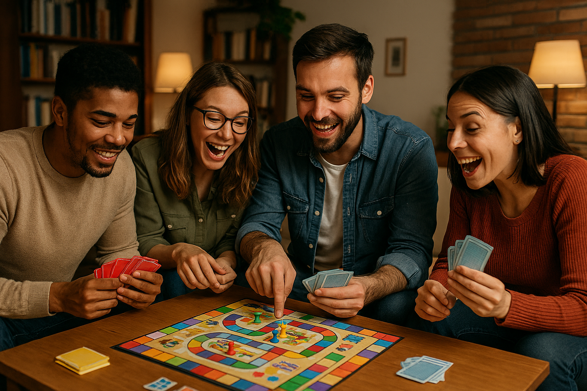

# CS-1030-Final-Project
Final Project w/ Files

# CoHabitFun 🎉

Bringing people together to have fun! Plan group activities, host game nights, and make shared memories easy.

## Features
- Plan and suggest group activities
- Track scores and voting for party games
- Share event details and reminders

## How to Use
1. Clone the repo
2. Open `index.html` in your browser

## Screenshots

## Contact
Have ideas? Contact us at fun@cohabitfun.com
